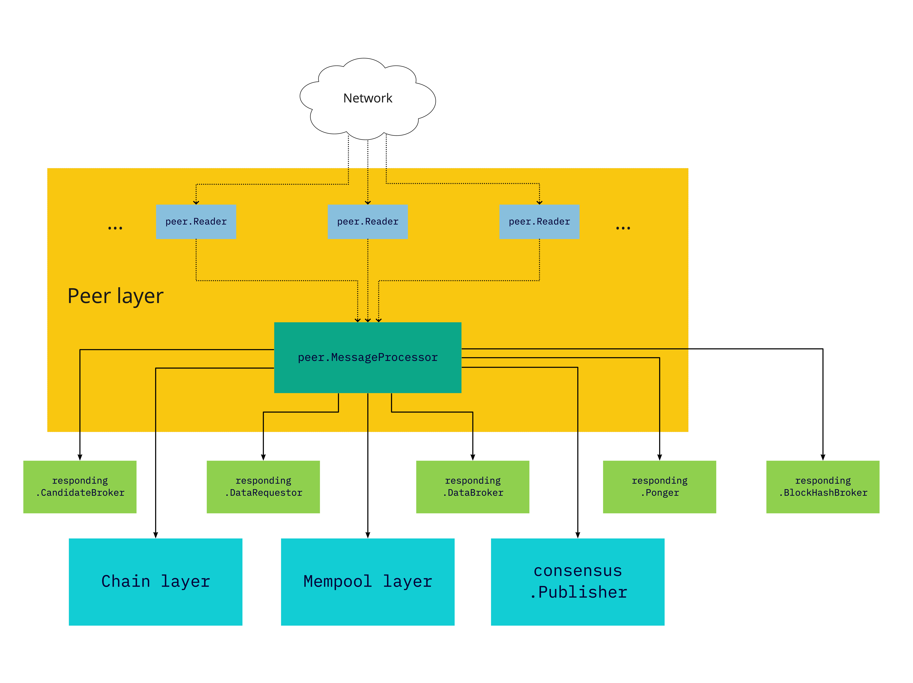

# [pkg/p2p](./pkg/p2p)

Some documentation on the p2p wire format, gossip and point to point messaging
architecture.

<!-- ToC start -->
##  Contents

   1. [Architecture](#architecture)
      1. [Reader](#reader)
      1. [Writer](#writer)
      1. [Component layout](#component-layout)
<!-- ToC end -->

## Architecture

The architecture for the p2p component of the node is based on an **actor
model**. In simple terms, we create subprocesses for each node we are connected
to, which are then killed once the connection drops.

More accurately, we launch two goroutines for each peer - one for the `Reader`
end, and one for the `Writer` end. This allows us to fully decouple both
directions of I/O from each other, and increase throughput and reliability.

If one of the goroutines encounters a fatal error, it drops the connection, and
propagates the error upwards. The error will subsequently trigger the killing of
the related goroutine.

### Reader

A `peer.Reader` goroutine will continually attempt to read frames of data from
the network connection, conform to the [wire protocol](./wire.md). Once read,
these frames are decoded, by verifying the magic number, the message checksum,
and the topic for validity. Once all checks pass, a message is passed to
the `peer.MessageProcessor`, which connects the P2P component to all other
components in the node.

The `MessageProcessor` allows the `Reader` to trigger certain callbacks, which
may or may not return a properly encoded response message. If such a response
message is received, the `MessageProcessor` ensures it is queued into the
corresponding `Writer` for this network connection.

### Writer

A `peer.Writer` goroutine, when instantiated, registers
a [ring buffer](../util/container/ring/) to the `Gossip` topic, on the event
bus. This allows any component in the node to add messages to the ring buffers
of all `peer.Writer` goroutines, allowing for easy **gossiping** of messages.

Additionally, when launching the goroutine, a channel is passed, which
accepts `bytes.Buffer` structures directly. This channel is used to send
response messages, as outlined above, from the `MessageProcessor` to
the `Writer`. This allows for directed delivery of messages to a single node.

### Component layout

Copyright © 2018-2022 Dusk Network
[MIT Licence](https://github.com/dusk-network/dusk-blockchain/blob/master/LICENSE)
